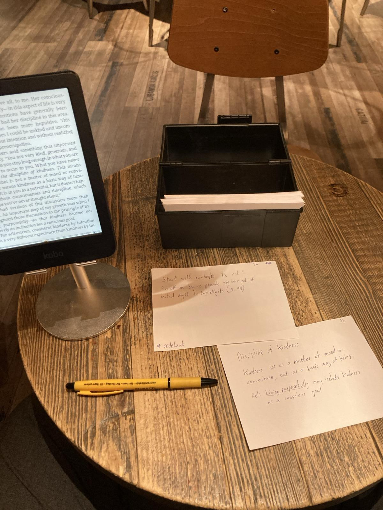

#+AUTHOR: Martin Edström
#+EMAIL: meedstrom91@gmail.com
#+STARTUP: content
* org-node
#+HTML: 

I like [[https://github.com/org-roam/org-roam][org-roam]] but found it too slow, so I made [[https://github.com/meedstrom/quickroam][quickroam]].  And that idea spun off into this package, a standalone thing.  It may also be easier to pick up than org-roam.

- *If you were using org-roam*, there is nothing to migrate.  You can use both packages.  It's the same on-disk format: "notes" are identified by their org-id.

  In pursuit of being "just org-id", this package has no equivalent setting to =org-roam-directory= -- it just looks up what [[https://github.com/meedstrom/org-mem][org-mem]] knows, which by default includes every file in =org-id-locations= and more.

- *If you were not using org-roam*, maybe think of it as somewhat like [[https://github.com/alphapapa/org-recent-headings][org-recent-headings]] tooled-up to the extent that you won't need other methods of browsing, as long as you give IDs to all objects of interest.

  If you were the sort of person to prefer ID-links over file links or any other type of link, you're in the right place!  Now you can rely on IDs, and---if you want---stop worrying about filenames, directories and subtree hierarchies.  As long as you've assigned an ID to a heading or file, you can find it later.

** What's a "node"?

My life can be divided into two periods "*before org-roam*" and "*after org-roam*".  I crossed a kind of gap once I got a good way to link between my notes.  It's odd to remember when I just relied on browsing subtrees and filesystem directories -- what a strange way to work!

I used to lose track of things I had written, under some forgotten heading in a forgotten file in a forgotten directory.  The org-roam method let me *find and build on* my own work, instead of [[https://en.wikipedia.org/wiki/Cryptomnesia][recreating it all the time]].

At the core, all the "notetaking packages" ([[https://github.com/rtrppl/orgrr][orgrr]]/[[https://github.com/localauthor/zk][zk]]/[[https://github.com/EFLS/zetteldeft][zetteldeft]]/[[https://github.com/org-roam/org-roam][org-roam]]/[[https://github.com/protesilaos/denote][denote]]/[[https://github.com/kaorahi/howm][howm]]/[[https://github.com/kisaragi-hiu/minaduki][minaduki]]/...) try to help you with this: make it easy to link between notes and explore them.

Right off the bat, that imposes two requirements: a method to search for notes, since you can't link to something you can't search for, and a design-choice about what kinds of things should turn up as search hits.  What's a "note"?

Just searching for Org files is too coarse.  Just searching for any subtree anywhere brings in too much clutter.

*Here's what org-roam invented.*  It turns out that if you limit the search-hits to just those files and subtrees you've deigned to assign an org-id -- which roughly maps to /everything you've ever thought it was worth linking to/ -- it filters out the noise excellently.

Once a subtree has an ID you can link to, it's a "node" because it has joined the wider graph, the network of linked nodes.  I wish the English language had more distinct sounds for the words "node" and "note", but to clarify, I'll say "ID-node" when the distinction matters (which it rarely does).

** Benchmarks on my machine

The original reason that org-node exists.

|                                | org-roam | org-node |
|--------------------------------+----------+----------|
| Time to index my 3000 nodes    | 2m 48s   | 0m 02s   |
| Time to save file w/ 400 nodes | 5--10s   | instant  |
| Time to display 20 backlinks   | 5--10s   | instant  |
| Time to open minibuffer        | 1--3s    | instant  |

** Features

A comparison of three systems that all permit relying on org-id and don't lock you into the concept of "one-note-per-file".

| Feature                          | org-roam | org-node         | [[https://github.com/toshism/org-super-links][org-super-links]]      |
|----------------------------------+----------+------------------+----------------------|
| Backlinks                        | yes      | yes              | yes                  |
| Node search and insert           | yes      | yes              | -- (suggests [[https://github.com/alphapapa/org-ql][org-ql]]) |
| Node aliases                     | yes      | yes              | --                   |
| Node exclusion                   | yes      | yes              | not applicable       |
| Refile                           | yes      | yes              | --                   |
| Rich backlinks buffer            | yes      | yes              | --                   |
| Customize how backlinks shown    | yes      | yes              | yes                  |
| Reflinks                         | yes      | yes              | --                   |
| Ref search                       | yes      | yes (as aliases) | not applicable       |
| Org 9.5 @citations as refs       | yes      | yes              | not applicable       |
| Support org-ref v3               | yes      | limited          | not applicable       |
| Support org-ref v2               | yes      | --               | not applicable       |
| Work thru org-roam-capture       | yes      | yes              | ?                    |
| Work thru org-capture            | --       | yes              | ?                    |
| Daily-nodes                      | yes      | yes              | --                   |
| Node sequences                   | --       | yes              | --                   |
| Show backlinks in same window    | --       | yes              | yes                  |
| Cooperate with org-super-links   | --       | yes              | not applicable       |
| Fix link descriptions            | --       | yes              | --                   |
| List dead links                  | --       | yes              | --                   |
| Rename file when title changes   | --       | yes              | --                   |
| Warn about duplicate titles      | --       | yes              | --                   |
| Principled "related-section"     | --       | yes              | yes                  |
| Untitled notes                   | --       | limited          | --                   |
| org-protocol extension           | yes      | --               | --                   |
| Support =roam:= links            | yes      | -- (wontfix)     | --                   |
| Can have separate note piles     | yes      | -- (wontfix)     | not applicable       |
| Some query-able cache            | yes      | yes              | --                   |
| Async cache rebuild              | --       | yes              | not applicable       |

* Get started

Go to the manual and close this tab.

- in a web browser: [[https://github.com/meedstrom/org-node/blob/main/org-node.org]]
- or in Emacs after installation: [[info:org-node]]

* Advice: Start with a paper Zettelkasten

Many people on forums say that you should do *a paper slip-box first* before going digital.

I didn't take this advice for a long time, but... they're right.

So let me try to bootstrap you:

If you are currently in the EU, you can order the pictured paper slips and box here:

- https://www.123ink.se/HAN-kortlada-A6-svart-HA-976-13-i23800-t76314.html
- https://www.123ink.se/Papper-Fotopapper/Kopieringspapper/A6/80-gram-p165367.html

Once these products arrive, take them and a pen with you to the local cafe, if it's a quiet noontime hour (otherwise a library, better in the afternoon).

Then have a warm coffee, lean back, and read https://zettelkasten.de/introduction/.
